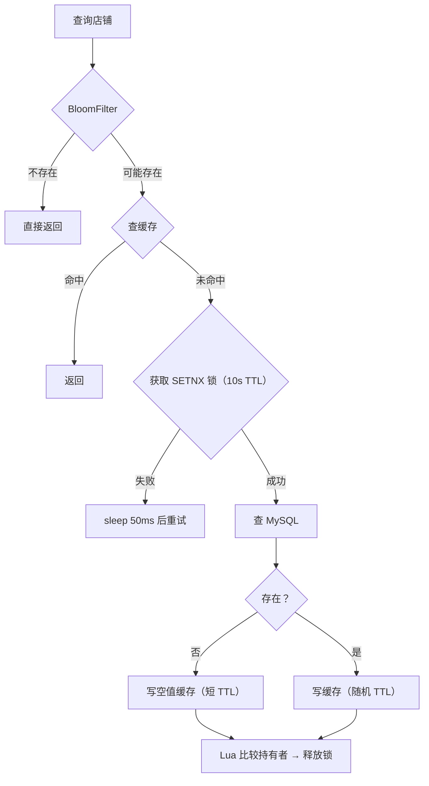
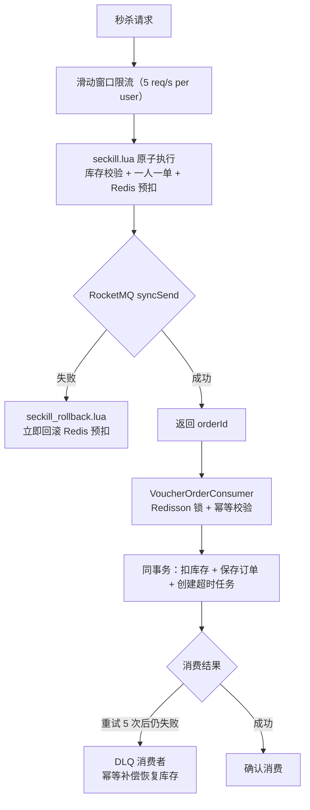
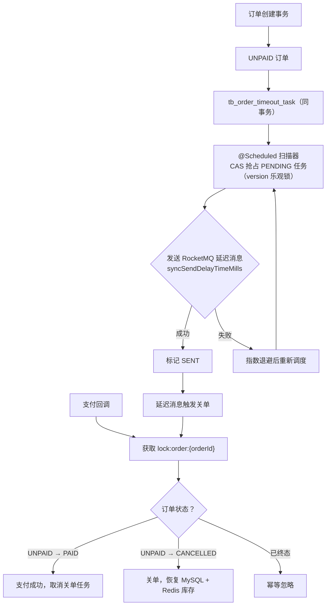
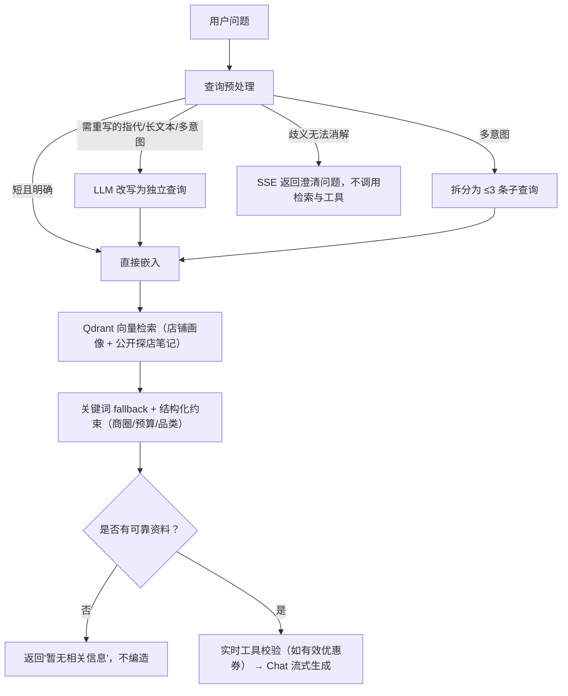
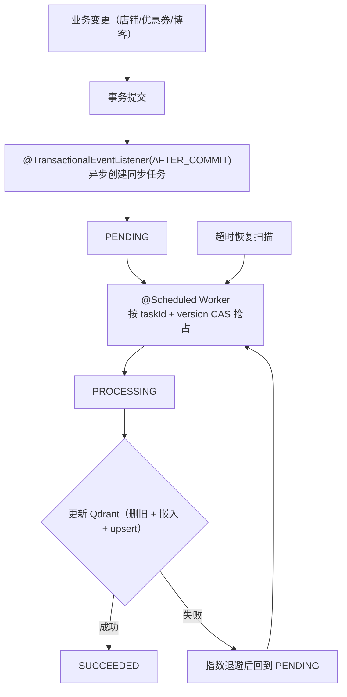

# Niche Review

面向本地生活场景的 Java 后端项目，覆盖店铺查询、优惠券秒杀、社交点评和 AI 导购。

<a id="nav"></a>

## 导航

- [快速开始](#quick-start)
- [核心能力](#capabilities)
- [关键设计决策](#decisions)
- [接口与代码索引](#reference)
- [验证材料清单](#evidence-index)
- [项目边界](#boundaries)

<a id="quick-start"></a>

## 快速开始

### 环境

JDK 8 / Maven 3.8+ / MySQL 8.x / Redis 6+ / RocketMQ / Docker（Qdrant）

### 1. 数据库

```sql
CREATE DATABASE hmdp DEFAULT CHARACTER SET utf8mb4 COLLATE utf8mb4_general_ci;
```

新环境执行 `src/main/resources/db/hmdp.sql`。已有数据库按时间顺序执行 `src/main/resources/db/upgrade_*.sql`。

### 2. 配置

创建 `src/main/resources/application-local.yaml`（已 gitignore）：

```yaml
spring:
  datasource:
    url: jdbc:mysql://127.0.0.1:3306/hmdp?useSSL=false&serverTimezone=Asia/Shanghai&characterEncoding=utf8
    username: your-username
    password: your-password
  redis:
    host: 127.0.0.1
    port: 6379
    password: your-password

rocketmq:
  name-server: 127.0.0.1:9876
```

启动时通过环境变量注入 AI 服务配置（详见 `application.yaml` 中 `ai.*` 段），默认 `ai.chat.provider=mock` 和 `ai.embedding.provider=disabled`。不配置外部 AI 服务也可以启动核心业务和 Mock AI 对话；真实 RAG 需要配置 Embedding 服务并启动 Qdrant。

### 3. 启动 Qdrant（可选，AI 功能需要）

```bash
docker run -d --name qdrant --restart unless-stopped \
  -p 6333:6333 \
  -e QDRANT__SERVICE__API_KEY=your-api-key \
  -v qdrant-storage:/qdrant/storage \
  qdrant/qdrant:v1.18.2
```

### 4. 启动

```bash
mvn spring-boot:run -Dspring-boot.run.profiles=local
```

后端 `http://localhost:8081`，前端静态文件位于 `frontend/app`，Nginx 配置示例见 `frontend/nginx/nginx.conf.example`。

### 5. 运行验证

```bash
# 缓存、消息幂等、DLQ 和超时关单集成测试
mvn -q -Dtest=ReliabilityIntegrationTest test

# AI Trace、查询预处理、检索与工具隔离测试
mvn -q -Dtest="AiTraceCoreTest,AiReadOnlyToolTraceTest,AiQueryPreprocessorTest,AiConversationQueryRewriteTest,ShopKnowledgeServiceImplTest" test

# 生成 JMeter 10,000 个用户 Token
mvn -q -Dtest=HmDianPingApplicationTests#prepareJmeterTokens test
```

<a id="capabilities"></a>

## 核心能力

### 店铺缓存治理

**问题**：高并发查询下，缓存穿透（大量查询不存在的店铺 ID）、击穿（热点店铺缓存过期时大量请求打到 MySQL）和雪崩（批量 key 同时过期）。

**方案**：

- Redisson `RBloomFilter` 前置拦截不存在的 ID，防止穿透
- `SETNX` 互斥锁（10s TTL + Lua 脚本比较持有者后释放），同一时刻只有一个线程重建缓存
- `RedisData` 逻辑过期包装——缓存过期后返回旧数据，后台线程异步重建，避免击穿
- 随机 TTL 防止批量 key 同时过期
- 缓存更新在 MySQL 事务 `afterCommit` 后删除；事务回滚不删缓存



**证据**：[可靠性验证](docs/project-proof/reliability-verification.md) — 事务后删缓存、过期锁误删防护均通过。

[↑ 回到导航](#nav)

### 可靠异步秒杀

**问题**：秒杀场景下库存扣减和一人一单校验必须原子化；异步下单时消息发送可能失败；消费重试耗尽后库存永久丢失。

**方案**：



每一层的失败都有补偿路径：

| 故障点 | 处理 | 一致性保证 |
|---|---|---|
| RocketMQ 发送失败 | 同步检查 `SendStatus`，失败立即 Lua 回滚 | 订单级幂等标记防止重复回滚 |
| 消费失败（业务异常） | RocketMQ 重试 5 次 | 用户-优惠券联合唯一索引 |
| 重试耗尽 | DLQ 消费者执行补偿 | 回滚脚本按 orderId 去重 |
| 重复消费 | orderId 幂等 + DB 唯一约束 | 重复消息不重复扣库存 |

**证据**：[秒杀压测](docs/project-proof/seckill-pressure-test.md) 使用 10,000 个不同用户令牌，在 30 秒 Ramp-Up 内发起 100 张券的抢购请求，平均吞吐约 **333 req/s**；订单数和唯一用户数均为 **100**，MySQL/Redis 库存均为 **0**（无超卖）。该吞吐是本次压测场景的平均值，不代表系统最大承载 QPS。[对账 SQL](docs/project-proof/seckill-verify.sql) 可独立核实。

[↑ 回到导航](#nav)

### 支付与超时关单

**问题**：15 分钟支付窗口内，支付回调与超时关单可能并发，导致已支付订单被误关或已关订单被反向支付；延迟消息投递失败会导致关单任务丢失。

**方案**：



- **共享锁**：支付和关单使用同一个 `lock:order:{orderId}` Redisson 锁，后到达的请求不能反转已完成的迁移
- **DB 任务表**：关单任务和订单在同一事务落库，不会丢；version CAS 防止重复投递
- **指数退避**：延迟消息发送失败时不立即重试，避免雪崩

**证据**：[支付与关单竞争](docs/project-proof/payment-timeout-race.md) 覆盖支付先到、关单先到和重复延迟消息三个场景。

[↑ 回到导航](#nav)

### 混合 RAG 检索

**问题**：用户问题可能包含指代（"第一家怎么样"）、多意图（"推荐火锅同时预算 100"）、长输入；仅靠向量检索在口语化查询上召回不准。

**方案**：



- **改写与检索分离**：改写结果只用于检索，原始问题保留用于对话和工具决策
- **无证据拒答**：没有业务资料支撑时直接拒答，不依赖模型常识编造
- **关键词 fallback**：启用 fallback 后执行 MySQL 关键词搜索，并与经过结构化约束的向量结果合并去重；向量相似度阈值 `0.35` 用于判断纯向量结果是否可靠

**证据**：[会话级端到端评测](docs/project-proof/rag-conversation-evaluation-evidence.md) 40 条冻结多轮用例，真实 `chat()` + SSE + 工具 + Trace 执行，人工复核 **37/40 正确（92.5%）**。3 个失败用例（CE018/CE019/CE038）已记录根因。

[↑ 回到导航](#nav)

### 请求级 Trace

**问题**：一次 AI 请求可能经过查询改写 → 向量检索 → Agent 规划 → 工具调用 → 模型生成 → SSE 推送 → 消息持久化 7 个阶段，出问题时无法定位是哪个环节出错。

**方案**：

每次 `/ai/conversations/{conversationId}/chat` 生成独立 `requestId` 和 `traceId`，全链路传递：

```text
CHAT
├── SSE_STREAM
├── QUERY_PREPROCESS → QUERY_REWRITE_MODEL
├── RETRIEVAL → EMBEDDING / QDRANT_SEARCH / KEYWORD_SEARCH / RESULT_MERGE
├── AGENT_ROUTE → AGENT_PLAN / TOOL_CALL × N
├── FINAL_MODEL
└── MESSAGE_PERSIST
```

- `message_start`、`message_end` 和 `error` SSE 事件均携带 `requestId` + `traceId`
- 根 Trace、Span、模型日志、工具日志按 `traceId` 关联，工具另有独立 `toolCallId`
- Span 仅保留脱敏属性（模式、数量、店铺 ID、模型、Token），默认保留 30 天
- 异步线程通过 MDC 传播 trace 上下文

**证据**：将 `traceId` 填入 [trace 导出 SQL](docs/project-proof/ai-agent-trace-export.sql) 即可还原该次请求的完整调用链。[Trace 示例](docs/project-proof/ai-agent-trace.md) 记录了两次真实请求的检索、工具、SSE、耗时和 Token。

[↑ 回到导航](#nav)

### 增量知识同步

**问题**：店铺/优惠券/博客变更后，Qdrant 向量库需要同步更新；Qdrant 短暂不可用时不能丢失任务。

**方案**：



- **持久化优先**：已落库的任务再由 Worker 异步执行，Qdrant 不可用时通过重试恢复；业务提交到任务落库之间仍存在极小的进程崩溃窗口
- **合并连续变更**：同一 shop 的多次变更合并为一条任务（`INSERT ... ON DUPLICATE KEY`）
- **故障恢复**：超时扫描器回收卡在 PROCESSING 状态的任务

**证据**：[知识同步故障恢复](docs/project-proof/knowledge-sync-failure.md) 记录了 Qdrant 中断期间任务重试与服务恢复后同步最新文档的过程。

[↑ 回到导航](#nav)

<a id="decisions"></a>

## 关键设计决策

### 为什么从 Redis Stream 切到 RocketMQ

最初的秒杀异步下单用 Redis Streams + `StreamMessageListenerContainer` 实现。三个痛点：

1. **消息发送无确认**：`XADD` 成功后即返回，如果消费者永远不会 ACK（例如 bug 导致消息格式错误），消息沉在 Stream 里没有 DLQ 兜底
2. **消费者恢复不可控**：Spring Data Redis 的 Stream 监听器异常处理不透明，重试行为依赖框架版本
3. **延迟消息需自建**：关单需要 15 分钟延迟投递，Redis Streams 不支持，得另起一套定时轮询

切到 RocketMQ 后：`syncSend` 返回 `SendStatus` 可立即判断发送成败；重试 5 次 + DLQ 形成完整兜底链；`syncSendDelayTimeMills` 原生支持毫秒级延迟消息。

### 为什么关单用 DB 任务表而不是纯延迟消息

RocketMQ 延迟消息本身没有持久化“这个关单任务已创建”的业务记录。单独依赖延迟消息时，发送结果未知或 Broker 异常后缺少可靠的补投和对账依据。任务表存在 MySQL 里并与订单同事务落库——只要订单创建成功，关单任务就具备可扫描、可重试的记录。

### 为什么 Agent maxSteps 设为 1

每增加一个 step 意味着多一次 Chat API 往返（约 2-5 秒）。在当前业务范围（只开放 4 个只读工具，查询模式固定），一步规划即可覆盖所有场景。多步留给未来工具扩展时再打开。

[↑ 回到导航](#nav)

<a id="reference"></a>

## 接口与代码索引

### 主要接口

| 场景 | 方法与路径 | 认证 |
|---|---|---|
| 秒杀下单 | `POST /voucher-order/seckill/{voucherId}` | 需要 |
| 模拟支付 | `POST /payment/simulate/{orderId}` | 需要 |
| 店铺详情（缓存） | `GET /shop/{id}` | 不需要 |
| 附近店铺（GEO） | `GET /shop/of/type?typeId=&x=&y=` | 不需要 |
| 博客点赞/取消 | `PUT /blog/like/{id}` | 需要 |
| 关注 Feed 流 | `GET /blog/of/follow?lastId=&offset=` | 需要 |
| 签到 | `POST /user/sign` | 需要 |
| AI 对话（SSE） | `POST /ai/conversations/{conversationId}/chat` | 需要 |
| AI 会话列表 | `GET /ai/conversations` | 需要 |

受保护接口需请求头 `Authorization: {token}`。

### 核心实现入口

| 模块 | 文件 |
|---|---|
| 店铺缓存 | [`ShopServiceImpl`](src/main/java/com/hmdp/service/impl/ShopServiceImpl.java) · [`SimpleRedisLock`](src/main/java/com/hmdp/utils/SimpleRedisLock.java) · [`unlock.lua`](src/main/resources/unlock.lua) |
| 秒杀下单 | [`VoucherOrderServiceImpl`](src/main/java/com/hmdp/service/impl/VoucherOrderServiceImpl.java) · [`VoucherOrderConsumer`](src/main/java/com/hmdp/mq/VoucherOrderConsumer.java) · [`VoucherOrderDeadLetterConsumer`](src/main/java/com/hmdp/mq/VoucherOrderDeadLetterConsumer.java) · [`seckill.lua`](src/main/resources/seckill.lua) · [`seckill_rollback.lua`](src/main/resources/seckill_rollback.lua) |
| 关单 & 支付 | [`OrderTimeoutTaskServiceImpl`](src/main/java/com/hmdp/service/impl/OrderTimeoutTaskServiceImpl.java) · [`OrderTimeoutListener`](src/main/java/com/hmdp/mq/OrderTimeoutListener.java) · [`PaymentServiceImpl`](src/main/java/com/hmdp/service/impl/PaymentServiceImpl.java) |
| RAG 检索 | [`ShopKnowledgeServiceImpl`](src/main/java/com/hmdp/service/impl/ShopKnowledgeServiceImpl.java) · [`QdrantKnowledgeClient`](src/main/java/com/hmdp/ai/QdrantKnowledgeClient.java) |
| 查询预处理 | [`AiQueryPreprocessor`](src/main/java/com/hmdp/ai/AiQueryPreprocessor.java) |
| Agent & 工具 | [`AiAgentRunner`](src/main/java/com/hmdp/ai/AiAgentRunner.java) · [`AiReadOnlyToolServiceImpl`](src/main/java/com/hmdp/service/impl/AiReadOnlyToolServiceImpl.java) |
| AI 对话 & Trace | [`AiConversationServiceImpl`](src/main/java/com/hmdp/service/impl/AiConversationServiceImpl.java) · [`AiTraceServiceImpl`](src/main/java/com/hmdp/service/impl/AiTraceServiceImpl.java) |
| 知识同步 | [`AiKnowledgeSyncTaskServiceImpl`](src/main/java/com/hmdp/service/impl/AiKnowledgeSyncTaskServiceImpl.java) · [`ShopKnowledgeChangedListener`](src/main/java/com/hmdp/event/ShopKnowledgeChangedListener.java) |

[↑ 回到导航](#nav)

<a id="evidence-index"></a>

## 验证材料清单

| 验证项 | 文档 | 结论 |
|---|---|---|
| 秒杀压测 | [`seckill-pressure-test.md`](docs/project-proof/seckill-pressure-test.md) | 333 req/s，无超卖 |
| 秒杀对账 SQL | [`seckill-verify.sql`](docs/project-proof/seckill-verify.sql) | 独立验证 SQL |
| 可靠性验证 | [`reliability-verification.md`](docs/project-proof/reliability-verification.md) | 3/3 通过 |
| 支付关单竞争 | [`payment-timeout-race.md`](docs/project-proof/payment-timeout-race.md) | 支付/关单/重复消息全覆盖 |
| 会话级 RAG 评测 | [`rag-conversation-evaluation-evidence.md`](docs/project-proof/rag-conversation-evaluation-evidence.md) | 37/40（92.5%） |
| 知识同步故障恢复 | [`knowledge-sync-failure.md`](docs/project-proof/knowledge-sync-failure.md) | Qdrant 中断 → 重试 → 恢复 |
| AI Trace 示例 | [`ai-agent-trace.md`](docs/project-proof/ai-agent-trace.md) | 两条真实请求全链路 |
| Trace 导出 SQL | [`ai-agent-trace-export.sql`](docs/project-proof/ai-agent-trace-export.sql) | 按 traceId 还原调用链 |
| 请求级 Trace 设计 | [`ai-request-trace.md`](docs/project-proof/ai-request-trace.md) | 标识、降级、隐私、保留策略 |

<a id="boundaries"></a>

## 项目边界

- AI 工具只开放店铺、附近店铺、优惠券和公开探店笔记等只读能力；写操作由原有业务接口控制
- RAG 评测基于固定用例集与当前数据快照，不代表通用回答准确率
- 知识同步任务在业务提交后异步创建；提交到任务落库之间存在极小进程崩溃窗口
- 项目面向本地生活场景设计，秒杀和关单的库存模型不适用于多 SKU / 购物车场景
- AI 服务默认 `mock`/`disabled`，不配置外部 API 也能跑通全部业务功能

[↑ 回到导航](#nav)
