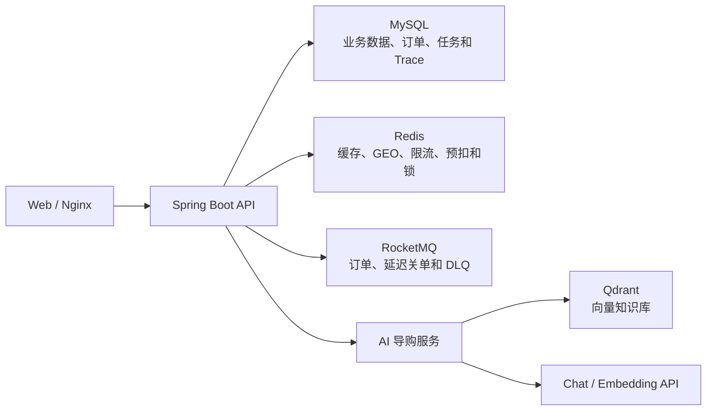
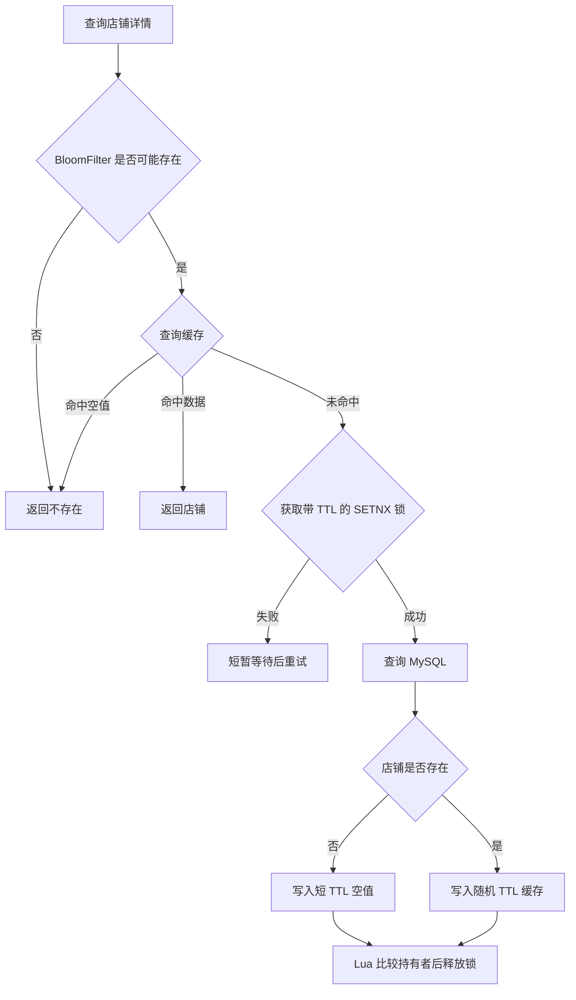
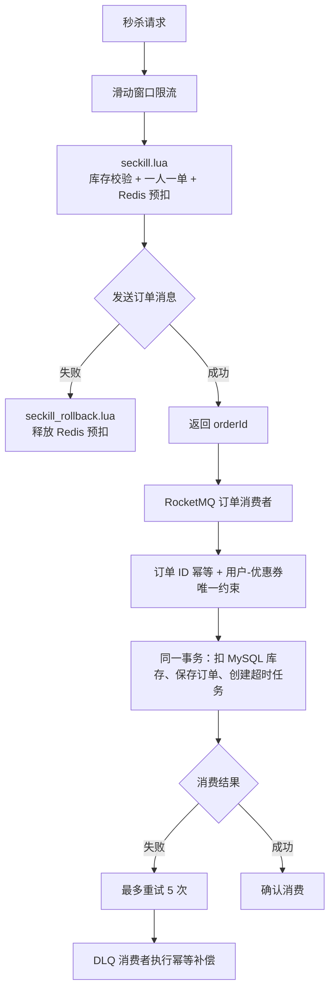
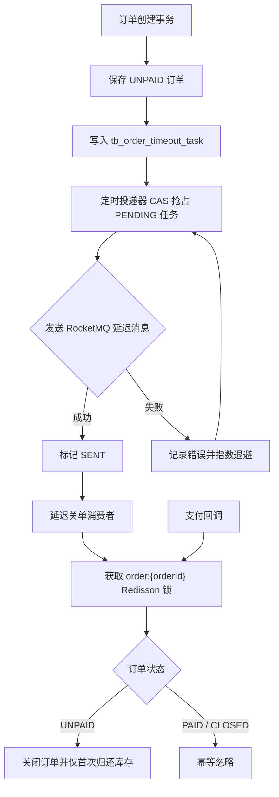
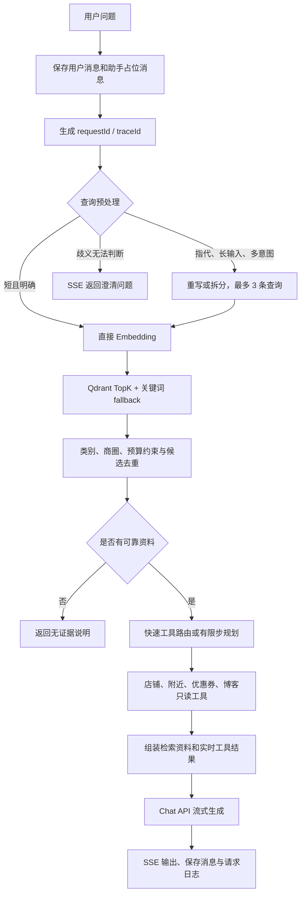
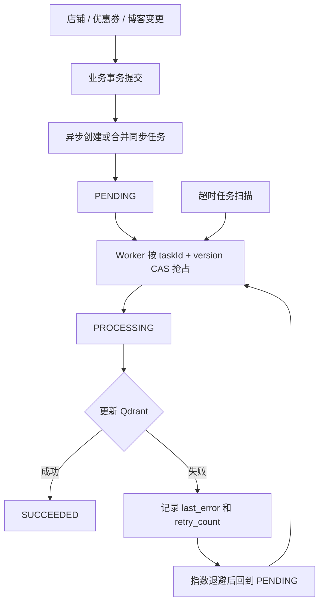

# Niche Review

Niche Review 是一个面向本地生活场景的 Java 后端项目，提供店铺查询、优惠券秒杀、社交点评和 AI 导购能力。

项目重点解决三类实际问题：高并发查询下的 Redis 缓存治理、异步下单与支付超时的最终一致性，以及基于真实业务数据的 RAG 检索与流式 AI 对话。

<a id="overview"></a>

## 导航

| 章节 | 说明 |
| --- | --- |
| [核心能力](#highlights) | 项目解决的问题与关键实现 |
| [基础后端设计](#backend-foundation) | 登录、店铺发现、社交互动与签到的业务底座 |
| [总体架构](#architecture) | 缓存、交易、AI 导购和同步链路 |
| [验证与恢复](#verification) | 自动化测试、压测、RAG 评测和故障恢复记录 |
| [快速开始](#quick-start) | 本地依赖、配置与启动方式 |
| [接口与代码索引](#code-map) | 常用接口和核心实现入口 |

<a id="highlights"></a>

## 核心能力

- **店铺缓存治理**：结合 Redisson BloomFilter、空值缓存、随机 TTL 和带过期时间的 SETNX 互斥锁，处理缓存穿透、击穿和雪崩；锁使用唯一持有者标识和 Lua 比较删除，店铺更新在事务提交后删除缓存。
- **可靠异步秒杀**：Lua 原子完成库存预扣和一人一单校验，RocketMQ 异步创建订单；订单 ID 幂等、用户-优惠券联合唯一索引、消费重试和 DLQ 补偿共同处理重复消费及最终失败。
- **可靠超时关单**：订单和超时任务在同一事务落库，定时投递器以版本号 CAS 抢占任务并指数退避；支付回调与延迟关单共用订单级 Redisson 锁，避免状态反转和库存重复归还。
- **混合 RAG 检索**：店铺画像、有效优惠券和公开探店笔记写入 Qdrant；对指代、长输入和多意图问题按需重写或拆分，再融合向量召回、关键词 fallback 与类别、商圈、预算约束。
- **增量知识同步**：业务变更后创建持久化同步任务，使用 CAS、指数退避和超时恢复更新 Qdrant，避免已落库任务因短暂外部服务故障长期丢失。
- **可观测 AI 导购**：每个聊天请求生成独立的 `requestId`、`traceId` 和 Span；检索、工具、模型、SSE 与消息持久化可通过同一 Trace 精确关联。

## 业务范围

| 领域 | 功能 |
| --- | --- |
| 用户 | 手机验证码登录、Token 刷新、登出、登录拦截和用户上下文 |
| 店铺 | 分类查询、详情缓存、关键词查询、Redis GEO 附近店铺 |
| 社交 | 博客发布、点赞、关注、共同关注和 Feed 流滚动分页 |
| 秒杀 | Redis 预扣、异步下单、失败补偿、超时关单和模拟支付 |
| AI 导购 | 多轮会话、RAG 混合检索、只读业务工具、SSE 流式输出 |

<a id="backend-foundation"></a>

## 基础后端设计

项目先实现本地生活点评的核心业务，再在真实店铺、优惠券和博客数据之上扩展高并发交易与 AI 导购。

| 业务链路 | 设计 | 关键数据结构 |
| --- | --- | --- |
| 登录与鉴权 | 验证码登录后将用户 DTO 写入 Redis Hash；拦截器按 Token 恢复 `UserHolder`，登出时删除 Token | `login:token:{token}` Hash、ThreadLocal |
| 店铺发现 | 分类列表优先从缓存读取；按分类和坐标查询时使用 Redis GEO 先得到店铺 ID 与距离，再按原顺序回表查询详情 | `shop:geo:{typeId}` GEO、`ORDER BY FIELD` |
| 博客互动 | 点赞集合与数据库点赞数双写；查询时回填作者与当前用户点赞状态 | `blog:liked:{blogId}` Set |
| 关注与 Feed 流 | 关注关系落 MySQL；博主发帖时将博客 ID 投递给粉丝收件箱，按时间戳分页读取 | `feed:{userId}` ZSet、滚动分页 `minTime + offset` |
| 签到与 UV | 月度签到使用 Bitmap；连续签到通过 `BITFIELD` 位运算统计；页面 UV 使用 HyperLogLog | Bitmap、HyperLogLog |

## 技术栈

| 分类 | 组件 |
| --- | --- |
| 后端 | Java 8、Spring Boot 2.3.12、Spring MVC、AOP、MyBatis-Plus |
| 数据 | MySQL 8.x、Redis、Redisson、Lua |
| 消息与并发 | RocketMQ、Redisson 分布式锁、滑动窗口限流 |
| AI | Qdrant、OpenAI-Compatible Chat / Embedding API、SSE |
| 工程工具 | Maven、Docker、Nginx、JMeter |

<a id="architecture"></a>

## 总体架构



### 1. 店铺缓存重建与删除



店铺更新在 MySQL 事务提交后，通过 `afterCommit` 删除 `cache:shop:{shopId}`。事务回滚时不删除缓存，也不创建知识同步任务。

### 2. 秒杀异步下单与失败补偿



生产者发送失败和 DLQ 最终补偿复用 `seckill_rollback.lua`。脚本只有成功删除 `seckill:reservation:{orderId}` 后才移除用户购买标记并归还库存，因此重复补偿不会多加库存。

### 3. 支付与超时关单



支付和关单都只允许从 `UNPAID` 进行状态迁移，后到达的请求不能反转已完成状态。

### 4. RAG、工具调用与请求级 Trace



原始问题用于会话保存、工具决策和最终回答；重写结果只用于检索。没有可靠业务资料时，系统直接拒答，不把无关候选交给模型生成事实性回答。

每次 `/ai/conversations/{conversationId}/chat` 调用建立独立 Trace：

```text
CHAT
├── SSE_STREAM
├── QUERY_PREPROCESS
├── RETRIEVAL
│   ├── EMBEDDING
│   ├── QDRANT_SEARCH
│   ├── KEYWORD_SEARCH
│   └── RESULT_MERGE
├── AGENT_ROUTE
│   ├── AGENT_PLAN（按需）
│   └── TOOL_CALL × N
├── FINAL_MODEL
└── MESSAGE_PERSIST
```

`message_start`、`message_end` 和 `error` SSE 事件都会返回服务端生成的 `requestId` 与 `traceId`。根 Trace、Span、模型日志和工具日志均按 `traceId` 关联；工具还具有独立 `toolCallId`。Span 仅保留模式、数量、店铺 ID、模型和 Token 等脱敏属性，默认保留 30 天。

### 5. 知识库增量同步



任务按 `shop_id` 合并连续变更。已持久化任务在 Qdrant 短暂不可用时会重试，并在服务恢复后同步最新店铺文档。

<a id="verification"></a>

## 验证与故障恢复

### 结果概览

| 验证项 | 口径 | 当前结果 |
| --- | --- | --- |
| 可靠性集成测试 | 事务后删缓存、过期锁误删防护、重复订单消息 | `3/3` 通过，`Failures=0`，`Errors=0` |
| 秒杀压测 | 10,000 个不同 Token、100 张券、30 秒 Ramp-Up | 平均 `333.2 req/s`；订单数和唯一用户数均为 `100`；MySQL/Redis 库存均为 `0` |
| RAG 混合检索 | 43 条事实类问题、7 条无结果问题 | 相较纯向量检索，Hit@1：`88.37% -> 97.67%`；Hit@3：`93.02% -> 100%`；正确拒答 `7/7` |
| 查询预处理评测 | 40 条固定测试集，其中 35 条可检索、5 条歧义澄清 | 生产链路 Hit@1：`65.71% -> 82.86%`；Hit@3：`71.43% -> 91.43%`；歧义澄清 `5/5` |
| 请求级 Trace | 真实 AI 请求 | 根 Trace、Span、模型日志和 3 次工具调用可由同一 `traceId` 精确还原 |

以上 Hit@K 只衡量正确店铺是否被召回，不等同于最终模型回答准确率。

### 关键故障处理

| 故障点 | 处理方式 | 一致性边界 |
| --- | --- | --- |
| 缓存锁过期后被重新获取 | 唯一持有者标识 + Lua 比较删除 | 旧线程不能删除新锁 |
| RocketMQ 订单消息发送失败 | Lua 回滚 Redis 预扣 | 订单级预占标记保证最多归还一次 |
| 消费重试耗尽 | DLQ 消费者执行幂等补偿 | 重复死信不会重复增加库存 |
| 延迟消息投递失败 | 任务表记录错误并指数退避 | CAS 避免同版本任务重复投递 |
| 支付与关单竞争 | 订单锁 + 状态条件更新 | 已支付订单不被关闭，已关闭订单不被反向支付 |
| Qdrant 暂时不可用 | 持久化同步任务重试和超时恢复 | 已落库任务恢复后同步最新文档 |
| 单个只读工具失败 | 记录失败 Span 和工具日志，隔离异常 | 不直接中断 SSE 主链路 |

### 验证材料

| 文档 | 内容 |
| --- | --- |
| [秒杀压测记录](docs/project-proof/seckill-pressure-test.md) | JMeter 参数、业务拒绝口径和原始聚合指标 |
| [秒杀对账 SQL](docs/project-proof/seckill-verify.sql) | 订单数、唯一用户数、MySQL/Redis 库存核对 |
| [可靠性验证](docs/project-proof/reliability-verification.md) | 缓存锁、重复消费、MQ 发送失败和 DLQ 补偿 |
| [支付与关单竞争](docs/project-proof/payment-timeout-race.md) | 支付先到、关单先到和重复延迟消息 |
| [RAG 评测报告](docs/project-proof/rag-evaluation.md) | 50 条案例的指标、口径和失败样例 |
| [查询重写评测](docs/project-proof/query-rewrite-evaluation.md) | A/B/C/D 对照、模式判断和 Bad Case |
| [知识同步故障恢复](docs/project-proof/knowledge-sync-failure.md) | Qdrant 中断、任务重试与恢复记录 |
| [AI 调用 Trace](docs/project-proof/ai-agent-trace.md) | 两条真实请求的检索、工具、SSE、耗时和 Token |
| [请求级 Trace 设计](docs/project-proof/ai-request-trace.md) | 标识、Span、失败降级、隐私和保留策略 |
| [Trace 导出 SQL](docs/project-proof/ai-agent-trace-export.sql) | 通过 `traceId` 导出完整调用链 |

<a id="quick-start"></a>

## 快速开始

### 1. 环境要求

- JDK 8
- Maven 3.8+
- MySQL 8.x
- Redis 6+
- RocketMQ NameServer 与 Broker
- Docker（运行 Qdrant）
- 可选：Nginx（静态前端与 `/api` 反向代理）

### 2. 初始化数据库

```sql
CREATE DATABASE hmdp DEFAULT CHARACTER SET utf8mb4 COLLATE utf8mb4_general_ci;
```

新环境执行 [hmdp.sql](src/main/resources/db/hmdp.sql)。已有数据库按时间顺序执行 `src/main/resources/db/upgrade_*.sql`；请求级 Trace 改造需要额外执行 [upgrade_20260731_ai_request_trace.sql](src/main/resources/db/upgrade_20260731_ai_request_trace.sql)。

### 3. 本地配置

创建 `src/main/resources/application-local.yaml`。该文件已被 Git 忽略，不要提交密码、IP 或 API Key。

```yaml
spring:
  datasource:
    url: jdbc:mysql://127.0.0.1:3306/hmdp?useSSL=false&serverTimezone=Asia/Shanghai&characterEncoding=utf8
    username: your-username
    password: your-password
  redis:
    host: 127.0.0.1
    port: 6379
    password: your-password

rocketmq:
  name-server: 127.0.0.1:9876
```

在 IDE 运行配置中添加：

```text
--spring.profiles.active=local

AI_CHAT_PROVIDER=openai-compatible
AI_CHAT_BASE_URL=https://your-provider/v1/chat/completions
AI_CHAT_MODEL=your-chat-model
AI_CHAT_API_KEY=your-chat-api-key

AI_EMBEDDING_PROVIDER=openai-compatible
AI_EMBEDDING_BASE_URL=https://your-provider/v1/embeddings
AI_EMBEDDING_MODEL=your-embedding-model
AI_EMBEDDING_API_KEY=your-embedding-api-key

AI_QDRANT_URL=http://127.0.0.1:6333
AI_QDRANT_API_KEY=your-qdrant-api-key
```

### 4. 启动 Qdrant

```bash
docker run -d --name qdrant --restart unless-stopped \
  -p 6333:6333 \
  -e QDRANT__SERVICE__API_KEY=your-qdrant-api-key \
  -v qdrant-storage:/qdrant/storage \
  qdrant/qdrant:v1.18.2
```

首次构建知识库时临时增加：

```text
AI_KNOWLEDGE_REBUILD_ON_START=true
```

看到 `Shop knowledge rebuild completed` 后移除该变量；后续业务变更使用增量同步。

### 5. 启动应用与前端

```bash
mvn spring-boot:run
```

后端默认地址为 `http://localhost:8081`。静态前端位于 `frontend/app`，Nginx 配置示例位于 `frontend/nginx/nginx.conf.example`。

### 6. 运行验证

```bash
# 缓存、消息幂等、DLQ 和超时关单相关集成测试
mvn -q -Dtest=ReliabilityIntegrationTest test

# AI Trace、查询预处理、检索与工具异常隔离测试
mvn -q "-Dtest=AiTraceCoreTest,AiReadOnlyToolTraceTest,AiQueryPreprocessorTest,AiConversationQueryRewriteTest,ShopKnowledgeServiceImplTest" test

# 生成 JMeter 使用的 10,000 个用户 Token
mvn -q -Dtest=HmDianPingApplicationTests#prepareJmeterTokens test
```

重新运行检索评测时，设置 `AI_EVALUATION_ENABLED=true`：`AI_EVALUATION_MODE=rag` 运行混合检索评测，`AI_EVALUATION_MODE=query-rewrite` 运行查询预处理评测，`all` 同时运行两者。评测会更新 CSV 和报告，结束后应关闭该变量。

一次 AI 聊天的 `message_start`、`message_end` 和 `error` 都携带 `traceId`。将该值填入 [ai-agent-trace-export.sql](docs/project-proof/ai-agent-trace-export.sql)，即可导出根状态、Span、模型日志和工具日志。

<a id="code-map"></a>

## 接口与代码索引

### 常用接口

| 场景 | 方法与路径 |
| --- | --- |
| 秒杀下单 | `POST /voucher-order/seckill/{voucherId}` |
| 模拟支付 | `POST /payment/simulate/{orderId}` |
| 创建 AI 会话 | `POST /ai/conversations` |
| 会话列表 | `GET /ai/conversations?current=1` |
| 会话消息 | `GET /ai/conversations/{conversationId}/messages` |
| 重命名会话 | `PATCH /ai/conversations/{conversationId}` |
| 删除会话 | `DELETE /ai/conversations/{conversationId}` |
| SSE AI 对话 | `POST /ai/conversations/{conversationId}/chat` |

受保护接口需要请求头：

```http
Authorization: {token}
```

### 核心实现入口

| 模块 | 主要实现 |
| --- | --- |
| 店铺缓存治理 | [ShopServiceImpl](src/main/java/com/hmdp/service/impl/ShopServiceImpl.java)、[SimpleRedisLock](src/main/java/com/hmdp/utils/SimpleRedisLock.java)、[unlock.lua](src/main/resources/unlock.lua) |
| 秒杀下单与补偿 | [VoucherOrderServiceImpl](src/main/java/com/hmdp/service/impl/VoucherOrderServiceImpl.java)、[VoucherOrderConsumer](src/main/java/com/hmdp/mq/VoucherOrderConsumer.java)、[VoucherOrderDeadLetterConsumer](src/main/java/com/hmdp/mq/VoucherOrderDeadLetterConsumer.java) |
| 超时关单与支付竞争 | [OrderTimeoutTaskServiceImpl](src/main/java/com/hmdp/service/impl/OrderTimeoutTaskServiceImpl.java)、[OrderTimeoutListener](src/main/java/com/hmdp/mq/OrderTimeoutListener.java)、[PaymentServiceImpl](src/main/java/com/hmdp/service/impl/PaymentServiceImpl.java) |
| RAG 与查询预处理 | [AiQueryPreprocessor](src/main/java/com/hmdp/ai/AiQueryPreprocessor.java)、[ShopKnowledgeServiceImpl](src/main/java/com/hmdp/service/impl/ShopKnowledgeServiceImpl.java)、[QdrantKnowledgeClient](src/main/java/com/hmdp/ai/QdrantKnowledgeClient.java) |
| AI 对话与 Trace | [AiConversationServiceImpl](src/main/java/com/hmdp/service/impl/AiConversationServiceImpl.java)、[AiTraceServiceImpl](src/main/java/com/hmdp/service/impl/AiTraceServiceImpl.java)、[AiReadOnlyToolServiceImpl](src/main/java/com/hmdp/service/impl/AiReadOnlyToolServiceImpl.java) |

## 项目结构

```text
.
├── frontend/
│   ├── app/                         # 静态前端
│   └── nginx/nginx.conf.example     # Nginx 代理示例
├── docs/project-proof/              # 压测、评测、故障恢复与 Trace
├── src/main/java/com/hmdp/
│   ├── ai/                          # Chat、Embedding、RAG、Agent 与 Trace 上下文
│   ├── controller/                  # HTTP 与 SSE 接口
│   ├── event/                       # 知识同步事件监听
│   ├── mq/                          # 订单、关单和 DLQ 消费者
│   ├── service/impl/                # 业务、任务和 AI 服务实现
│   └── utils/                       # Redis Key、锁和通用工具
└── src/main/resources/
    ├── db/                          # 初始化与升级 SQL
    ├── *.lua                        # 秒杀、补偿、限流和解锁脚本
    └── application.yaml             # 不含真实凭据的公共配置
```

## 项目边界

- RAG 指标基于固定评测集与当前数据快照，表示检索命中，不代表通用回答准确率。
- AI 工具只开放店铺、附近店铺、优惠券和公开探店笔记等只读能力；写操作仍由原有业务接口和登录鉴权控制。
- 知识同步任务在业务提交后异步创建，已落库任务可以依靠重试与超时恢复；业务提交到任务落库之间仍存在极小的进程崩溃窗口。
