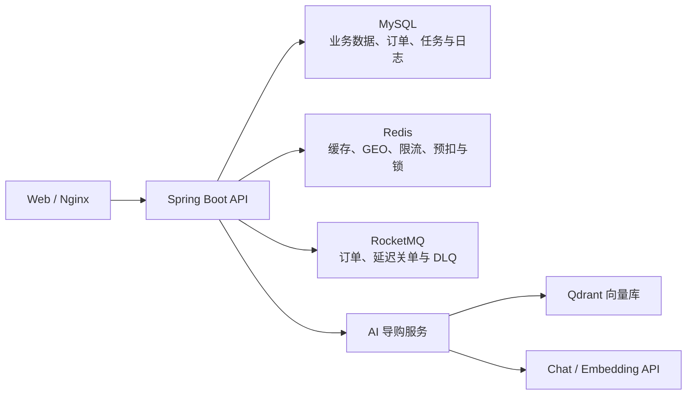
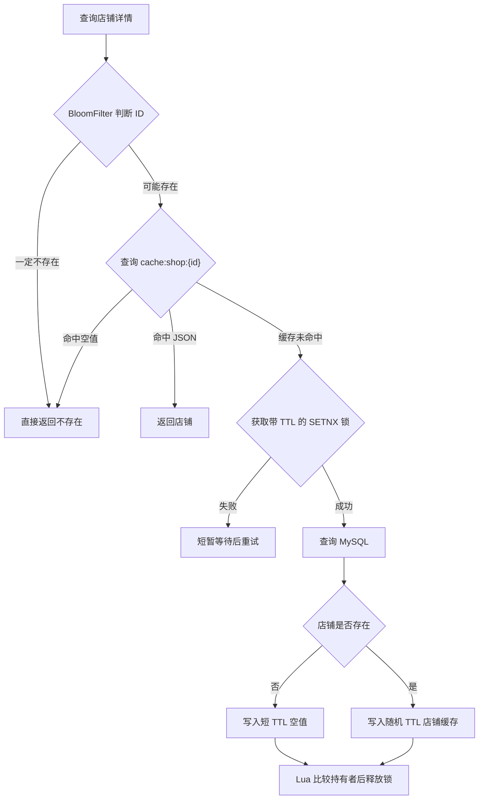
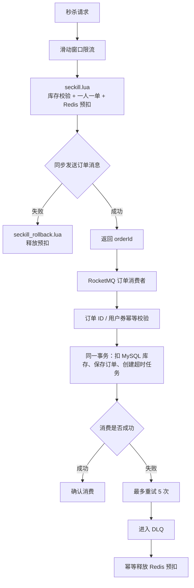
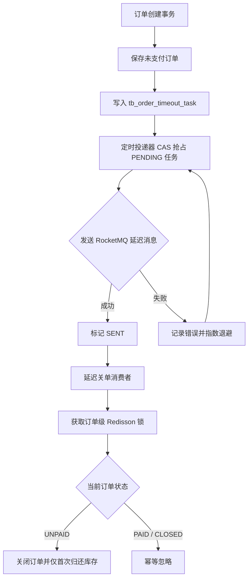
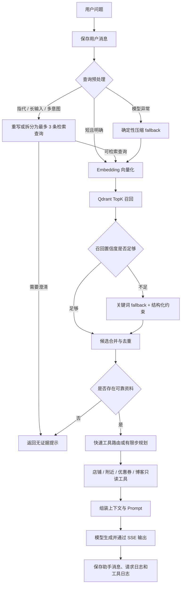
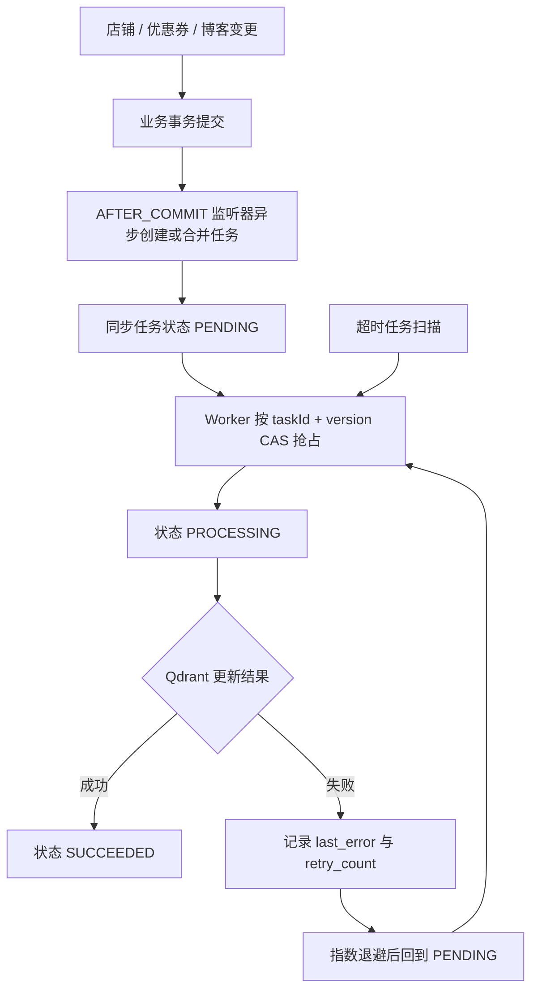

# Niche Review

Niche Review 是一个面向本地生活场景的 Java 后端项目，提供店铺查询、优惠券秒杀、社交点评和 AI 导购能力。

项目在传统点评业务基础上，重点实现了 Redis 缓存治理、RocketMQ 可靠异步订单、支付与超时关单并发控制，以及基于 Qdrant 的 RAG 混合检索与知识库增量同步。

## 快速导航

| 模块 | 内容 |
| --- | --- |
| [项目亮点](#highlights) | 缓存、秒杀、超时关单、RAG 与知识同步的核心设计 |
| [核心架构](#architecture) | 五条关键业务链路及其边界 |
| [测试与评测](#evaluation) | 自动化测试、压测对账、混合检索与查询重写评测 |
| [故障恢复](#failure-recovery) | MQ、DLQ、超时任务和 Qdrant 故障处理 |
| [运行链路](#trace) | AI 检索、工具调用、SSE、耗时与 Token 记录 |
| [实现索引](#implementation-index) | 核心设计对应的代码与验证文档 |
| [快速开始](#quick-start) | 数据库、Redis、RocketMQ、Qdrant 与本地配置 |

<a id="highlights"></a>

## 项目亮点

- **Redis 缓存治理**：结合 Redisson BloomFilter、空值缓存、随机 TTL 与带过期时间的 SETNX 互斥锁，处理缓存穿透、击穿和雪崩；通过唯一持有者标识与 Lua 安全释放锁，并在事务提交后删除缓存。
- **可靠异步秒杀**：Lua 原子完成库存预扣和一人一单校验，RocketMQ 异步创建订单；通过消费幂等、失败重试、DLQ 与订单级预占标记完成最终失败补偿。
- **可靠超时关单**：订单和超时任务在同一事务内落库，由定时投递器通过版本号 CAS 和指数退避发送延迟消息；订单级 Redisson 锁协调支付回调与超时关单。
- **可评测的 RAG 检索**：聚合店铺、有效优惠券和公开探店笔记；短问题直接检索，指代、长输入和多意图问题按需重写或拆分，再结合向量召回、关键词 fallback 与结构化约束。
- **可恢复的知识同步**：业务变更后持久化同步任务，采用 CAS 抢占、指数退避和超时恢复更新 Qdrant，并记录 AI 检索、工具、耗时及 Token 数据。

## 业务能力

| 领域 | 功能 |
| --- | --- |
| 用户 | 手机验证码登录、Token 刷新、登出、登录拦截与用户上下文 |
| 店铺 | 分类查询、详情缓存、关键词查询、Redis GEO 附近店铺 |
| 社交 | 博客发布、点赞、关注、共同关注、Feed 流滚动分页 |
| 签到 | Redis Bitmap 月度签到与连续签到统计 |
| 秒杀 | Redis 预扣、RocketMQ 异步下单、失败补偿、超时关单和模拟支付 |
| AI 导购 | 多轮会话、RAG 混合检索、只读业务工具、SSE 流式输出 |

## 技术栈

| 分类 | 组件 |
| --- | --- |
| 后端 | Java 8、Spring Boot 2.3.12、Spring MVC、AOP |
| 数据访问 | MyBatis-Plus、MySQL 8.x |
| Redis | Spring Data Redis、Redisson、Lua、BloomFilter、GEO、ZSet、Bitmap |
| 消息与并发 | RocketMQ、Redisson 分布式锁 |
| AI | Qdrant、OpenAI-Compatible Chat / Embedding API、SSE |
| 工程工具 | Maven、Docker、Nginx、JMeter |

<a id="architecture"></a>

## 核心架构

### 系统组件



<a id="cache-architecture"></a>

### 1. 店铺缓存重建与删除



店铺更新先提交 MySQL 事务，再通过 `afterCommit` 删除 `cache:shop:{shopId}`。事务回滚时不删除缓存，也不发布知识库变更事件。

互斥锁保存唯一持有者标识，释放时由 Lua 先比较再删除，避免业务执行超时后旧线程误删其他线程重新获得的锁。

### 2. 秒杀异步下单与失败补偿



生产者发送失败和 DLQ 最终补偿复用 `seckill_rollback.lua`。脚本只有在成功删除 `seckill:reservation:{orderId}` 后，才移除用户购买标记并归还库存，因此重复执行不会多加库存。

数据库同时使用订单 ID 幂等和用户—优惠券联合唯一索引，分别处理重复消息与一人一单约束。

### 3. 可靠超时关单



支付回调与超时关单使用同一个订单锁，并通过状态条件更新控制 `UNPAID -> PAID` 或 `UNPAID -> CLOSED`。无论哪一方先到，后到请求都不能反转订单状态。

### 4. RAG 与 AI 导购



RAG 文档聚合店铺画像、当前有效优惠券和公开探店笔记。原始问题始终用于会话保存、工具规划和最终回答；重写结果只用于检索。对无可靠业务资料的问题直接拒答，避免把无关候选交给模型生成事实性回答。

只读工具白名单包括店铺详情、附近店铺、优惠券和公开博客。明确意图使用快速工具路由，复杂选择最多执行一轮规划。

### 5. 知识库增量同步



任务按 `shop_id` 合并连续变更，版本号 CAS 避免并发 Worker 重复处理同一版本；Qdrant 暂时不可用时，已经持久化的任务会持续重试并在服务恢复后同步最新数据。

> 当前边界：同步任务由事务提交后的异步监听器创建，因此业务已提交但任务尚未落库时仍存在极小的进程崩溃窗口。现有恢复机制保证的是已持久化任务不会因临时故障长期丢失。

<a id="evaluation"></a>

## 测试与评测

### 结果概览

| 验证项 | 固定口径 | 结果 |
| --- | --- | --- |
| Spring 集成测试 | 事务后删缓存、过期锁误删防护、重复订单消息 | `3/3` 通过，`Failures=0`，`Errors=0` |
| 秒杀压测 | 10,000 个不同 Token、10,000 线程、Ramp-Up 30 秒、库存 100 | 平均吞吐 `333.2 req/s`；订单数和唯一用户数均为 `100`；MySQL/Redis 库存均为 `0` |
| RAG 混合检索基线 | 43 条事实类问题、7 条无结果问题 | 相较纯向量检索，Hit@1：`88.37% -> 97.67%`；Hit@3：`93.02% -> 100%`；正确拒答 `7/7` |
| 查询重写四路对照评测 | 40 条固定测试集，其中 35 条可检索、5 条歧义澄清 | 原始混合检索到预处理后混合检索：Hit@1 `65.71% -> 88.57%`，Hit@3 `71.43% -> 94.29%`；歧义澄清 `5/5` |

两组指标评测对象不同：前者验证关键词 fallback 与结构化约束对纯向量检索的补强，后者验证查询预处理相对原始问题直接 Embedding 的收益。两者均表示检索命中率，不等同于模型最终回答准确率。

### 验证材料

| 文档 | 内容 |
| --- | --- |
| [秒杀压测记录](docs/project-proof/seckill-pressure-test.md) | JMeter 参数、原始聚合指标与业务拒绝口径 |
| [秒杀对账 SQL](docs/project-proof/seckill-verify.sql) | 订单数、唯一用户数、MySQL/Redis 库存核对 |
| [可靠性验证](docs/project-proof/reliability-verification.md) | 缓存锁、重复消费、MQ 发送失败与 DLQ 补偿 |
| [支付与关单竞争](docs/project-proof/payment-timeout-race.md) | 支付先到、关单先到及重复延迟消息 |
| [RAG 评测报告](docs/project-proof/rag-evaluation.md) | 50 条固定案例的指标、口径与结论 |
| [RAG 案例集](docs/project-proof/rag-cases.csv) | 每题预期事实、纯向量 Top3、混合检索 Top3 |
| [查询重写评测报告](docs/project-proof/query-rewrite-evaluation.md) | A/B/C/D 四路检索对照、组件收益、模式判断与 Bad Case |
| [查询重写案例集](docs/project-proof/query-rewrite-cases.csv) | 50 条开发/测试案例、历史上下文、预期模式与实际结果 |
| [知识库故障恢复](docs/project-proof/knowledge-sync-failure.md) | Qdrant 中断后任务重试并恢复为 SUCCEEDED |
| [AI 调用 Trace](docs/project-proof/ai-agent-trace.md) | 两条真实请求的检索、工具、SSE、耗时与 Token |
| [Agent 面试演练](docs/project-proof/agent-interview-drill.md) | 围绕 Agent、RAG、交易一致性与评测口径的高压追问及回答 |

<a id="failure-recovery"></a>

## 故障与恢复

| 故障点 | 恢复机制 | 一致性边界 |
| --- | --- | --- |
| 缓存锁过期后被重新获取 | 唯一持有者标识 + Lua 比较删除 | 旧持有者不能删除新锁 |
| RocketMQ 订单消息发送失败 | 调用补偿 Lua 释放预扣 | 订单级预占标记保证最多归还一次 |
| 消费重试耗尽 | DLQ 消费者执行幂等补偿 | 重复死信不会重复增加库存 |
| 延迟消息投递失败 | 任务表记录错误并指数退避 | 版本号 CAS 防止同版本并发投递 |
| 支付与关单并发 | 共用订单锁并按当前状态更新 | 已支付订单不能关单，已关单订单不能再次回滚 |
| Qdrant 暂时不可用 | 同步任务持久化重试和超时恢复 | 已落库任务恢复后更新最新文档 |
| 只读工具异常 | 记录失败日志并隔离失败结果 | 单个工具失败不直接中断 SSE 主流程 |

<a id="trace"></a>

## 运行链路记录

| 场景 | 覆盖情况 | 记录 |
| --- | --- | --- |
| 优惠券与探店笔记查询 | RAG 候选、3 次工具调用、SSE、耗时与 Token | [Trace 1](docs/project-proof/ai-agent-trace.md#trace-1优惠券与探店笔记查询) |
| 朋友聚餐推荐 | 混合召回、快速工具路由、最终回答与请求日志 | [Trace 2](docs/project-proof/ai-agent-trace.md#trace-2朋友聚餐推荐) |
| 工具失败分支 | 写入 `success=0` 工具日志，隔离失败结果并继续主流程 | [`AiReadOnlyToolServiceImpl`](src/main/java/com/hmdp/service/impl/AiReadOnlyToolServiceImpl.java) |
| 未登录访问 AI 接口 | 登录拦截器返回 HTTP `401` | [`LoginInterceptor`](src/main/java/com/hmdp/utils/LoginInterceptor.java) |
| 外部服务中断恢复 | Qdrant 重试恢复、MQ 发送失败及 DLQ 补偿 | [知识库恢复](docs/project-proof/knowledge-sync-failure.md)、[秒杀恢复](docs/project-proof/reliability-verification.md) |

AI 工具只开放店铺、附近店铺、优惠券和公开探店笔记等只读能力；写操作继续由原有业务接口和登录鉴权控制。

<a id="implementation-index"></a>

## 核心设计与实现索引

| 核心设计 | 主要实现 | 测试与运行记录 |
| --- | --- | --- |
| 店铺缓存治理 | [`ShopServiceImpl`](src/main/java/com/hmdp/service/impl/ShopServiceImpl.java)、[`SimpleRedisLock`](src/main/java/com/hmdp/utils/SimpleRedisLock.java)、[`unlock.lua`](src/main/resources/unlock.lua) | [可靠性验证](docs/project-proof/reliability-verification.md) |
| 秒杀下单与补偿 | [`VoucherOrderServiceImpl`](src/main/java/com/hmdp/service/impl/VoucherOrderServiceImpl.java)、[`VoucherOrderConsumer`](src/main/java/com/hmdp/mq/VoucherOrderConsumer.java)、[`VoucherOrderDeadLetterConsumer`](src/main/java/com/hmdp/mq/VoucherOrderDeadLetterConsumer.java)、[`seckill.lua`](src/main/resources/seckill.lua)、[`seckill_rollback.lua`](src/main/resources/seckill_rollback.lua) | [可靠性验证](docs/project-proof/reliability-verification.md)、[压测记录](docs/project-proof/seckill-pressure-test.md) |
| 超时关单与支付竞争 | [`OrderTimeoutTaskServiceImpl`](src/main/java/com/hmdp/service/impl/OrderTimeoutTaskServiceImpl.java)、[`OrderTimeoutListener`](src/main/java/com/hmdp/mq/OrderTimeoutListener.java)、[`PaymentServiceImpl`](src/main/java/com/hmdp/service/impl/PaymentServiceImpl.java) | [竞争验证](docs/project-proof/payment-timeout-race.md) |
| RAG 混合检索与查询重写 | [`AiQueryPreprocessor`](src/main/java/com/hmdp/ai/AiQueryPreprocessor.java)、[`ShopKnowledgeServiceImpl`](src/main/java/com/hmdp/service/impl/ShopKnowledgeServiceImpl.java)、[`QdrantKnowledgeClient`](src/main/java/com/hmdp/ai/QdrantKnowledgeClient.java)、[`RagEvaluationRunner`](src/main/java/com/hmdp/evidence/RagEvaluationRunner.java)、[`QueryRewriteEvaluationRunner`](src/main/java/com/hmdp/evidence/QueryRewriteEvaluationRunner.java) | [混合检索评测](docs/project-proof/rag-evaluation.md)、[查询重写评测](docs/project-proof/query-rewrite-evaluation.md) |
| 知识库增量同步 | [`ShopKnowledgeChangedListener`](src/main/java/com/hmdp/event/ShopKnowledgeChangedListener.java)、[`AiKnowledgeSyncTaskServiceImpl`](src/main/java/com/hmdp/service/impl/AiKnowledgeSyncTaskServiceImpl.java) | [故障恢复记录](docs/project-proof/knowledge-sync-failure.md) |
| AI 会话、工具与 SSE | [`AiConversationServiceImpl`](src/main/java/com/hmdp/service/impl/AiConversationServiceImpl.java)、[`AiReadOnlyToolServiceImpl`](src/main/java/com/hmdp/service/impl/AiReadOnlyToolServiceImpl.java)、[`AiAgentRunner`](src/main/java/com/hmdp/ai/AiAgentRunner.java) | [AI Trace](docs/project-proof/ai-agent-trace.md)、[导出 SQL](docs/project-proof/ai-agent-trace-export.sql) |

<a id="quick-start"></a>

## 快速开始

### 1. 环境要求

- JDK 8
- Maven 3.8+
- MySQL 8.x
- Redis 6+
- RocketMQ NameServer 与 Broker
- Docker（用于运行 Qdrant）
- 可选：Nginx（用于静态前端与 `/api` 反向代理）

### 2. 初始化数据库

```sql
CREATE DATABASE hmdp DEFAULT CHARACTER SET utf8mb4 COLLATE utf8mb4_general_ci;
```

执行 [`hmdp.sql`](src/main/resources/db/hmdp.sql)。旧数据库升级时，再按时间顺序执行 `src/main/resources/db/upgrade_*.sql`。

### 3. 配置本地环境

创建 `src/main/resources/application-local.yaml`。该文件已被 Git 忽略，不要提交密码、IP 或 API Key。

```yaml
spring:
  datasource:
    url: jdbc:mysql://127.0.0.1:3306/hmdp?useSSL=false&serverTimezone=Asia/Shanghai&characterEncoding=utf8
    username: your-username
    password: your-password
  redis:
    host: 127.0.0.1
    port: 6379
    password: your-password

rocketmq:
  name-server: 127.0.0.1:9876
```

本地启动参数：

```text
--spring.profiles.active=local
```

### 4. 启动 Qdrant

```bash
docker run -d --name qdrant --restart unless-stopped \
  -p 6333:6333 \
  -e QDRANT__SERVICE__API_KEY=your-qdrant-api-key \
  -v qdrant-storage:/qdrant/storage \
  qdrant/qdrant:v1.18.2
```

在 IDE 运行配置中设置：

```text
AI_CHAT_PROVIDER=openai-compatible
AI_CHAT_BASE_URL=https://your-provider/v1/chat/completions
AI_CHAT_MODEL=your-chat-model
AI_CHAT_API_KEY=your-chat-api-key

AI_EMBEDDING_PROVIDER=openai-compatible
AI_EMBEDDING_BASE_URL=https://your-provider/v1/embeddings
AI_EMBEDDING_MODEL=your-embedding-model
AI_EMBEDDING_API_KEY=your-embedding-api-key

AI_QDRANT_URL=http://127.0.0.1:6333
AI_QDRANT_API_KEY=your-qdrant-api-key
```

首次全量构建知识库时额外设置：

```text
AI_KNOWLEDGE_REBUILD_ON_START=true
```

看到 `Shop knowledge rebuild completed` 后移除该变量，后续变更使用增量同步。

### 5. 启动应用

```bash
mvn spring-boot:run
```

后端默认地址为 `http://localhost:8081`。静态前端位于 `frontend/app`，Nginx 示例配置位于 `frontend/nginx/nginx.conf.example`。

### 6. 运行验证

```bash
# 缓存与消息幂等集成测试
mvn -q -Dtest=ReliabilityIntegrationTest test

# 生成 JMeter 使用的 10,000 个用户 Token
mvn -q -Dtest=HmDianPingApplicationTests#prepareJmeterTokens test
```

生成的 `tokens.csv` 包含登录 Token，已被 `.gitignore` 排除。JMeter 参数和对账步骤见[秒杀压测记录](docs/project-proof/seckill-pressure-test.md)。

重新运行评测时，设置 `AI_EVALUATION_ENABLED=true` 并选择模式后启动应用：`AI_EVALUATION_MODE=rag` 运行混合检索基线评测，`AI_EVALUATION_MODE=query-rewrite` 运行查询重写评测，`all` 运行两者。对应运行器会更新案例 CSV 与报告；完成后应关闭该变量。

AI 对话完成后，可以执行 [`ai-agent-trace-export.sql`](docs/project-proof/ai-agent-trace-export.sql) 导出消息、请求日志和工具日志。

## 关键接口

| 场景 | 方法与路径 |
| --- | --- |
| 秒杀下单 | `POST /voucher-order/seckill/{voucherId}` |
| 模拟支付 | `POST /payment/simulate/{orderId}` |
| 创建 AI 会话 | `POST /ai/conversations` |
| 会话列表 | `GET /ai/conversations?current=1` |
| 会话消息 | `GET /ai/conversations/{conversationId}/messages` |
| 重命名会话 | `PATCH /ai/conversations/{conversationId}` |
| 删除会话 | `DELETE /ai/conversations/{conversationId}` |
| SSE AI 对话 | `POST /ai/conversations/{conversationId}/chat` |

受保护接口需要请求头：

```http
Authorization: {token}
```

SSE 调用示例：

```bash
curl.exe -N -X POST "http://localhost:8081/ai/conversations/1/chat" \
  -H "Authorization: your-token" \
  -H "Content-Type: application/json" \
  -d "{\"content\":\"推荐适合朋友聚餐、人均 200 的餐厅\"}"
```

## 项目结构

```text
.
├── frontend/
│   ├── app/                          # 静态前端
│   └── nginx/nginx.conf.example      # Nginx 代理示例
├── docs/project-proof/               # 压测、评测、故障恢复与 Trace
├── src/main/java/com/hmdp/
│   ├── ai/                           # Qdrant、Embedding、Chat 与 Agent
│   ├── annotation/ aspect/           # 限流注解与 AOP
│   ├── config/                       # Web、Redis、AI 与调度配置
│   ├── controller/                   # HTTP 与 SSE 接口
│   ├── mq/                           # 订单、关单与 DLQ 消费者
│   ├── service/impl/                 # 业务与任务实现
│   └── utils/                        # Redis Key、锁与通用工具
└── src/main/resources/
    ├── db/                           # 初始化与升级 SQL
    ├── *.lua                         # 秒杀、补偿、限流与解锁脚本
    └── application.yaml              # 无真实凭据的公共配置
```

## 常用 Redis Key

| Key | 类型 | 用途 |
| --- | --- | --- |
| `login:token:{token}` | Hash | 登录用户信息 |
| `cache:shop:{shopId}` | String | 店铺详情缓存 |
| `bf:shop:id` | BloomFilter | 店铺 ID 预过滤 |
| `shop:geo:{typeId}` | GEO | 店铺地理坐标 |
| `feed:{userId}` | ZSet | 关注 Feed 收件箱 |
| `sign:{userId}:{yyyyMM}` | Bitmap | 用户签到 |
| `seckill:stock:{voucherId}` | String | 秒杀 Redis 库存 |
| `seckill:order:{voucherId}` | Set | 已购买用户标记 |
| `seckill:reservation:{orderId}` | String | 订单预占标记 |
| `lock:order:{orderId}` | String | 支付与关单互斥锁 |

## 项目边界

- 支付接口用于模拟支付状态流转，未接入真实第三方支付。
- RAG 指标来自固定 50 条问题和当前数据快照，不代表生产环境中的通用准确率。
- 知识同步的重试机制覆盖已持久化任务；事务提交后、任务落库前的极小崩溃窗口尚未通过事务 Outbox 消除。
- `application-local.yaml`、`tokens.csv` 和 IDE 环境变量可能包含敏感信息，不应提交到 Git。
